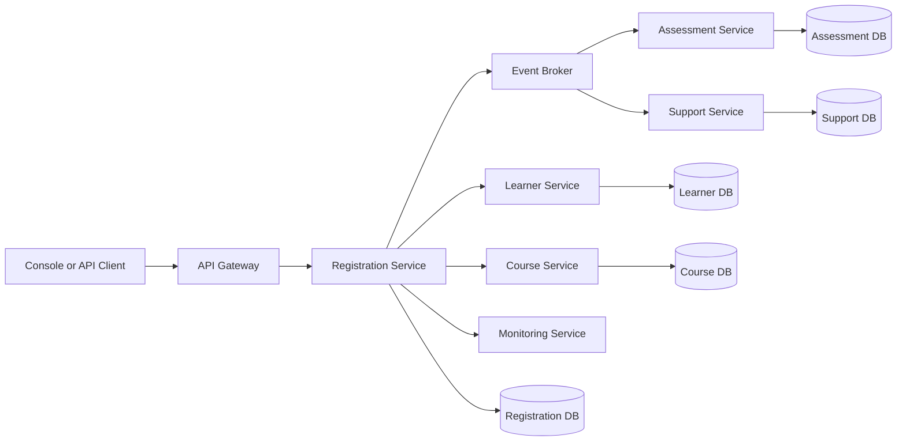

# Eduvos Enterprise Console Architecture

## Data modelling

The domain uses objects for learners, courses, registrations, assessments, and
support tickets. Lists preserve registration order and are simple for console
demonstrations. The engine protects those lists with `threading.Lock` while it
checks duplicates and capacity.

For a larger deployment, dictionaries indexed by learner and course IDs would
make duplicate checks close to O(1), while a relational database such as SQLite
would provide constraints, transactions, indexes, and durable concurrent writes.
JSON is appropriate here because the data set is small, portable, human-readable,
and easy to demonstrate. It should be replaced by SQLite or PostgreSQL when
multiple processes, larger data volumes, or audit history are required.

The input contract contains a `course_capacities` object and a `registrations`
array. Registration records begin in the `Pending` state; the registration
engine is responsible for transitioning them to `Approved` or `Rejected`.

## Design patterns

- **Singleton (`AppConfig`):** provides one application configuration object and
    protects instance creation with a lock.
- **Factory (`SupportTicketFactory`):** maps a ticket category to a concrete
    `SupportTicket` subtype, keeping construction decisions out of callers.
- **Strategy (`AssessmentCalculator`):** delegates score interpretation to a
    replaceable strategy, demonstrated by percentage and pass/fail calculations.

These patterns are deliberately small and have separate tests in
`tests/test_application.py`. They demonstrate the pattern responsibilities
without adding framework-specific complexity to the console application.

## Microservices readiness

Candidate independently deployable services are:

- **Learner Service:** learner identity, email validation, and learner records.
- **Course Service:** course catalogue, capacity, and enrollment availability.
- **Registration Service:** registration requests, duplicate prevention, and approval rules.
- **Assessment Service:** scores, dates, and assessment calculations.
- **Support Service:** ticket creation, status changes, and ticket history.
- **Monitoring Service:** structured events, metrics, tracing, and reports.

The registration service should communicate with learner and course services
through REST or gRPC for synchronous validation, and publish registration events
through a broker such as RabbitMQ or Kafka for asynchronous reporting and audit
consumers. Each service owns its data and exposes stable API contracts.

Testing should include unit tests for business rules, contract tests for API
boundaries, integration tests for persistence and messaging, and load tests for
concurrent registration spikes. A correlation ID should travel through every
request and event; OpenTelemetry can provide distributed traces and connect
registration latency to the relevant service and database calls.



## Profiling workflow

Run `python3 profiling/profileApp.py` to inspect the top cumulative functions.
The current likely bottleneck is linear duplicate scanning in the engine. The
next optimization is an indexed set of `(learner_id, course_id)` pairs, while
retaining the lock around the check-and-add operation. Compare before and after
using the same request fixture, worker count, and cProfile sort order.

## Verification

From the project root, install the declared development dependency and run:

```bash
python3 -m pip install -r requirements.txt
python3 -m pytest -q
python3 main.py
python3 profiling/profileApp.py
```

The automated tests cover validation, domain relationships, sequential and
concurrent registration rules, the three design patterns, input construction,
and monitoring counters.